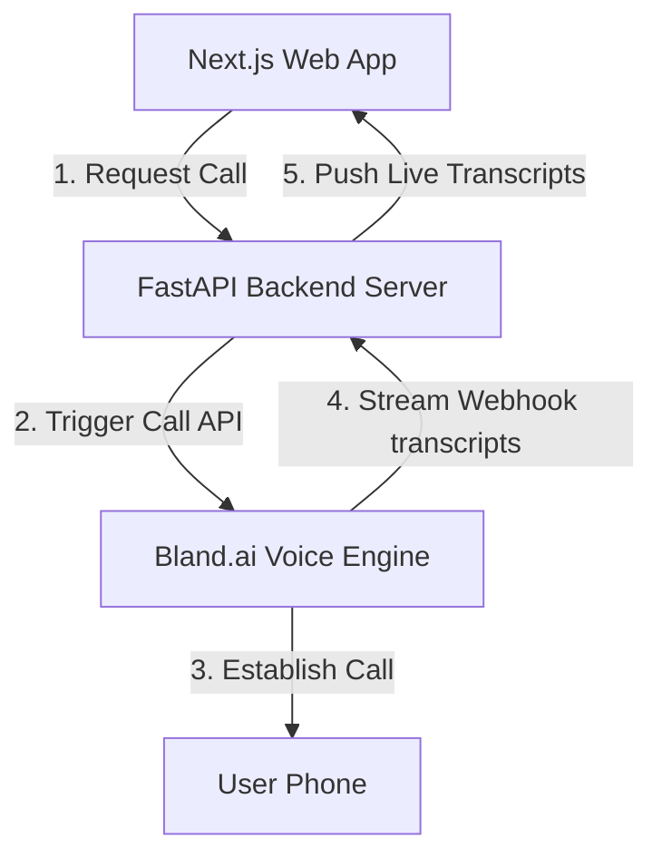

# Sunrise Interior ZARA AI Voice Agent

An intelligent, multilingual AI voice assistant built for **Sunrise Interiors** (premium home interiors in Bengaluru, India). Zara automatically follows up with customers who request outbound calls to discuss modular kitchens, custom wardrobes, and turnkey full-home interior packages.

---

## 🌟 Key Features

*   **Multilingual Calling**: Converses naturally in Indian English, simple Hindi, or a mix of both (Hinglish).
*   **Intelligent Pricing Consultation**: Dynamically answers user queries about three main interior design tiers:
    1.  *Modular Kitchens* (₹1.8 Lakhs – ₹5.5 Lakhs+)
    2.  *Premium Wardrobes* (₹85,000 – ₹3 Lakhs+)
    3.  *Turnkey Full-Home Interiors* (₹4.5 Lakhs for 2BHK / ₹6.5 Lakhs for 3BHK)
*   **Fast Conversational Response**: Fine-tuned for lowest latency with optimized voice turn-taking and quick interruption sensitivity.
*   **Real-time Live Transcript**: Streams the voice call conversation live to the website dashboard.

---

## 🏗️ Architecture Overview



*   **Frontend**: Next.js 16 (App Router) styled with Tailwind CSS, Lucide icons, and Framer Motion micro-animations.
*   **Backend**: FastAPI (Python) server acting as the controller for call scheduling, proxying, and webhook parsing.
*   **Telephony / Voice Agent**: Orchestrated via Bland.ai API running advanced multilingual conversational voice models.

---

## 🚀 Setup & Installation

### Prerequisite Environment Configuration

Create a `.env` file in the root directory:
```env
# Bland.ai Credentials
BLAND_API_KEY=your_bland_api_key_here

# Telephony Tunnel / Webhook URL
BASE_URL=https://your-public-tunnel-url.com
```

### 1. Backend Setup

1.  Create and activate a python virtual environment:
    ```bash
    python -m venv venv
    source venv/bin/activate  # On Windows: venv\Scripts\activate
    ```
2.  Install dependencies:
    ```bash
    pip install -r requirements.txt
    ```
3.  Start the FastAPI backend server:
    ```bash
    uvicorn main:app --port 8001 --reload
    ```

### 2. Frontend Setup

1.  Navigate to the `frontend` folder:
    ```bash
    cd frontend
    ```
2.  Install dependencies:
    ```bash
    npm install
    ```
3.  Start the Next.js dev server:
    ```bash
    npm run dev
    ```

---

## 📜 License

This project is licensed under the MIT License - see the [LICENSE](LICENSE) file for details.
